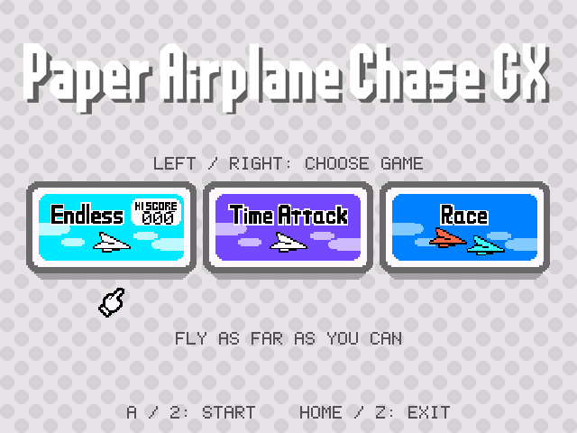
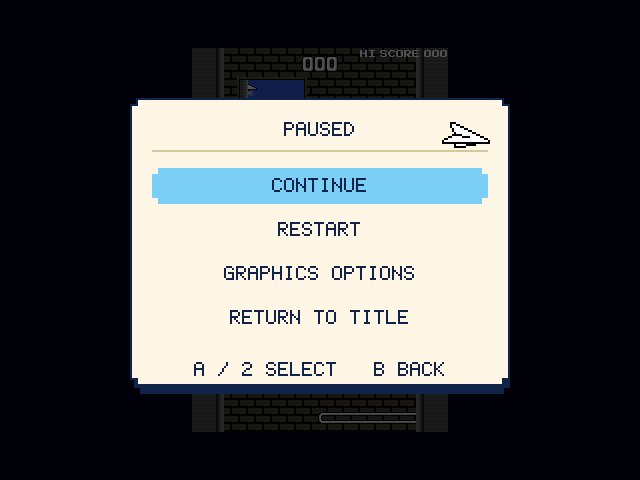
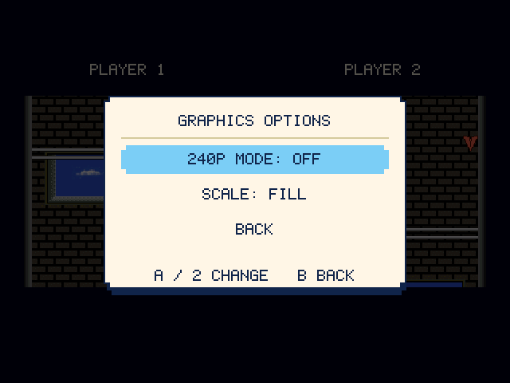

# Paper Airplane Chase GX

Sister project to [Bird & Beans GX](https://github.com/cmyksoda/Bird-and-Beans-GX)

A Wii homebrew port of **Paper Airplane Chase**, with Endless, all eight Time Attack courses and local two-player Race, original gameplay code, music and sound effects, and a new title screen and pause menu.

|Title Screen|Pause Menu|Graphics Options|
|---|---|---|
||||

## Install

You’ll need the Homebrew Channel, an SD card, and your own **(USA)(EnFrEs)** DSiWare ROM.

1. Extract the release ZIP to the root of your SD card.
2. Put your `.nds` ROM in `sd:/apps/paperplane/`, beside `boot.dol`. Any filename is fine. Unzip it first if it’s in a ZIP.
3. Launch **Paper Airplane Chase GX** from the Homebrew Channel.

The app checks the ROM and prepares its data automatically on first launch. Later launches use the saved cache, so you're free to remove the ROM after first successful boot. Other regions and revisions aren’t supported.

## Controls

| Controller | Move | Select | Pause | Back / exit |
|---|---|---|---|---|
| Wii Remote, horizontal | D-pad | 1 / 2 | Plus | Home |
| Wii Remote, vertical | D-pad | A | Plus | Home |
| Wii Remote + Nunchuk | Stick | C / Z | Plus | Home |
| Classic Controller | D-pad / left stick | A | Plus | Home |
| GameCube Controller | D-pad / stick | A | Start | Z |

In menus, select with A / 2 and go back with B. Left/right chooses a game, and Time Attack opens a menu for choosing one of its eight courses. Pressing A on a bare Wii Remote selects vertical controls; pressing 1 or 2 selects horizontal controls. B keeps the current grip.

In Endless and Time Attack, press a button or move the stick on another controller to switch all controls to it, including during play.

In Race, whoever starts the game is Player 1. Press a button or move the stick/D-pad on another controller to join as Player 2 and start the countdown. Idle controllers cannot claim a slot. Release any input held before Race started and press it again to join. Assignments stay fixed through restarts until returning to the title. Either player can pause; Player 1 operates the menus. Disconnecting an assigned controller pauses the race.

## Display and saves

Open **Pause → Graphics Options** to toggle **240p at 60 Hz** and choose between **Fixed and Fill** scaling.

Paper Airplane Chase shows both of the original DS screens at once: stacked into one tall tower in Endless and Time Attack, or side by side in Race. Fixed keeps the original pixels at their original size, since doubling them like Bird & Beans GX does wouldn't fit on a TV. Fill detects the Wii’s 4:3 or 16:9 setting and enlarges the image to fill as much of the screen as it can. Scaling applies to gameplay; menus always stay the same size, and the title and setup screens always use the full screen.

240p has half as many lines to draw with, so it blends neighboring lines together to keep the whole tower on screen. That way, thin ledges don't flicker as they scroll by.

Widescreen systems also show **Aspect Ratio** for the option to use a centered 4:3 view while in Fill mode.

All graphics options are saved when you leave the menu and restored on the next launch.

Your Endless high score, your best time on each Time Attack course and your graphics options are saved in `apps/paperplane/scores.dat`. Race wins aren't saved. Records are saved on game over, restart, return to title or a clean exit. Keep that file when updating. Powering off during a run can lose an unsaved record.

## License

The port code and documentation are **GPLv3**. Nintendo game data and the original Nintendo logo are excluded; third-party components retain their own licenses. See [license notices](licenses/README.md).

For the project logo, I only claim ownership of my modification: the **GX** addition. The original **Paper Airplane Chase** logo is Nintendo’s property. See [artwork attribution](licenses/Artwork.txt).

*This project was made with AI assistance. For more information, see [my AI usage statement](https://github.com/cmyksoda/cmyksoda/blob/main/AI_USAGE.md).*
